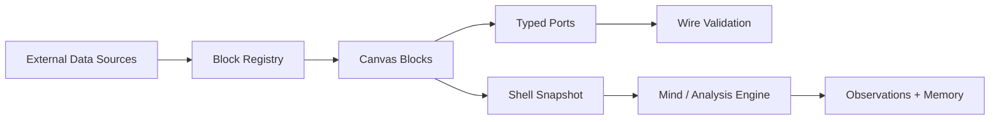

# OmniOS

<p align="center">
  
</p>

Spatial cognitive workspace for composing data, AI personas, notes, and analytical blocks on a typed canvas.

## Summary

OmniOS is a TypeScript / Next.js product prototype for a spatial analytical workspace. It treats data sources, AI personas, notes, and media as blocks that can be arranged on a canvas and connected by visible wires. The core product idea is that context should be inspectable: a user should be able to see which data sources, memory objects, and analytical components are connected before asking a system to reason over them.

## What It Demonstrates

- Frontend product architecture with Next.js, React, TypeScript, Zustand, and dnd-kit.
- A typed port and wire model for validating data flow between blocks.
- Shell snapshots that capture workspace state for downstream analysis.
- Product thinking around spatial workflows, memory, AI context, and external data integrations.

## Architecture

OmniOS is organized around a block registry, typed schemas, services for snapshots and port validation, and UI surfaces for composing blocks into shells. External data integrations can produce structured outputs that are wired into analytical or persona blocks.



## Installation

```bash
npm install
```

## Usage

```bash
npm run dev
```

Then open:

```text
http://localhost:3000
```

Useful scripts:

```bash
npm run build
npm run lint
npm run inspect-api
```

## Evidence

- Typed port and wire system validates block compatibility and supports controlled data conversion.
- Shell snapshot system captures blocks, focused context, observations, connections, and aggregate workspace state.
- Memory architecture documents a multi-layer approach to persistent context.
- Data integration work includes markets, public indicators, news, science, forecasting, and other external surfaces.

## Known Limitations

- This is a product prototype and architecture demo, not a finished operating system.
- Some data integrations may require API keys or local configuration.
- API-backed integrations require local credentials; use `.env.example` and do not commit real keys.
- The public README should link to screenshots or a short demo clip once the demo route is stable.

## Status

Product prototype / frontend platform artifact.
